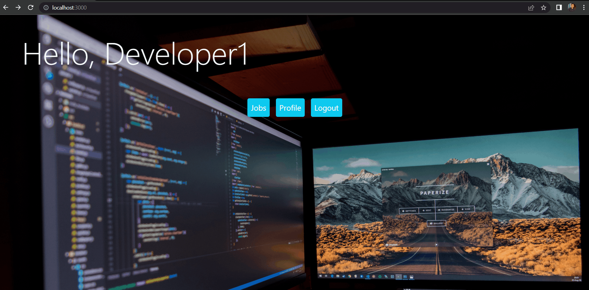

# Django Project - Simple Job Application (Frontend)
Built with [ReactJS](https://reactjs.org/) \
Simple Job Application where you can register as a recruiter (Company) who needs a task or project and want to hire a developer for it or we can register as a developer to be hired from an agency.

# Table of contents
- [Features](#features)
- [Process](#process)
- [Authors](#authors)

# Features
1) Register & Login as company

2) Create a Job

3) Register & Login as developer!

4) Apply for a Job

5) Accept a developer

# Process
1) [Backend](https://github.com/yhyamohamed/job_app_django)
2) Clone the project
```
git clone https://github.com/MohamedSaidCS/django-front.git
```
3) Install Packages
```
npm install
```
4) Run server
```
npm start
```
5) Open http://localhost:3000 to view it in your browsers